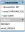

# Projet 1 : Intégration du [projet Basilique Saint-Ferjeux](https://github.com/J-D25/basilique_reflexion)
[Voir le site intégré](https://jessya.promo-159.codeur.online/basilique/).

## Objectif #1
Intégrer et dynamiser votre premier site web et son interface d'administration.
### Itération #B.1 : Extraire les éléments nécessaires à l'intégration
À partir du [fichier Figma fourni](https://www.figma.com/file/xP2a6tBXY3XdHG6TwofANX/Basilique-Saint-Ferjeux), extraire les ressources nécessaires à l'intégration
- Extraire les images et les logos
- Récupérer la liste des polices et les couleurs et les différentes tailles de caractères
### Itération #B.2 : Mettre en place la structure de la page
- Établir la structure minimale d'une page html valide
### Itération #B.3 : Intégrer l'entête
- Intégrer les titres et les paragraphes de l'entête
- Insérer les images de l'entête
- Insérer les éléments de navigation si nécessaire
- Insérer les liens hypertexte si nécessaire
### Itération #B.4 : Mettre en forme l'entête
- Mettre en forme le texte
- Gérer la position et l'affichage des éléments
- Gérer les fonds les dégradés et les ombres si nécessaire
### Itération #B.5 : Intégrer le contenu principal
- Intégrer les titres et les paragraphes
- Insérer les médias
- Insérer les liens
- Insérer le formulaire si nécessaire
### Itération #B.6 : Mettre en forme le contenu principal
- Mettre en forme le texte
- Gérer la position et l'affichage des éléments
- Gérer les fonds les dégradés et les ombres si nécessaire
### Itération #B.7 : Intégrer le pied de page
- Intégrer les titres et les paragraphes
- Insérer les médias
- Insérer les liens
- Insérer le formulaire si nécessaire
### Itération #B.8 : Mettre en forme le pied de page
- Mettre en forme le texte
- Gérer la position et l'affichage des éléments
- Gérer les fonds les dégradés et les ombres si nécessaire
### Itération #B.9 : Adapter le site aux différents supports
- Réaliser le responsive de votre page
### Itération #B.10 : Dynamiser les éléments du site
- À partir du prototypage réaliser les effets d'animation sur les liens, les boutons, les éléments de formulaire si nécessaire via CSS
### Itération #B.11 : Animer, sécuriser et améliorer les performances
- À partir du prototypage réaliser l'animation de l'entête
- Animer ou faire apparaître les différentes sections au scroll
- Sécuriser la saisie du formulaire si nécessaire
- Améliorer les performances du site
### Itération #B.12 : Concevoir la base de données du tableau de bord
- D'après la maquette du tableau de bord, réaliser le MCD, MLD et MPD
* 
### Itération #B.13 : Intégrer le tableau de bord
D'après la maquette réaliser l'intégration HTML, CSS et responsive du tableau de bord
### Itération #B.14 : Gérer l'inscription à la newsletter
- Réaliser les script JS et PHP permettant de gérer l'inscription à la newsletter.
### Itération #B.15 : Lister les personnes inscrites à la newsletter
- Réaliser le script PHP permettant de lister les personnes inscrites à la newsletter.
### Itération #B.16 : Exporter la liste des inscrits à la newsletter
- Réaliser le script PHP permettant d'exporter les inscrits à la newsletter au format csv
### Itération #B.17 : Protéger l'accès au tableau de bord
- Réaliser le script PHP de la connexion au tableau de bord